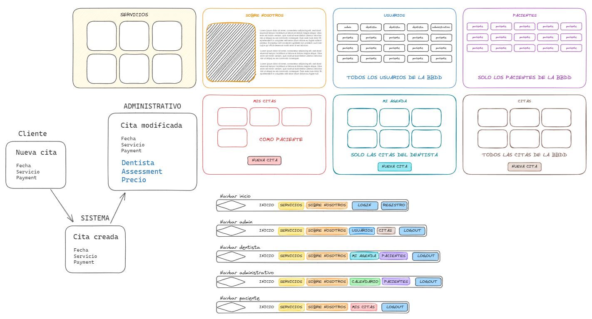

# Frontend de una clínica dental
<details>
  <summary>Contenido 📝</summary>
  <ol>
    <li><a href="#objetivo">Objetivo</a></li>
    <li><a href="#sobre-el-proyecto">Sobre el proyecto</a></li>
    <li><a href="#tecnologías-utilizadas">Stack - Tecnologías utilizadas</a></li>
    <li><a href="#instalación-en-local">Instalación en local</a></li>
    <li><a href="#endpoints">Endpoints</a></li>
    <li><a href="#contribuciones">Contribuciones</a></li>
    <li><a href="#agradecimientos">Agradecimientos</a></li>
    <li><a href="#contacto">Contacto</a></li>
    <li><a href="#licencia">Licencia</a></li>
  </ol>
</details>

## Objetivo
Este proyecto requería de un frontend que conectara con la API que desarrollé como proyecto anterior.

## Sobre el proyecto
Este frontend ha sido desarrollado por **Héctor Mateu**, como quinto proyecto del **Bootcamp de Full Stack Developer de Geekshubs Academy**, el cuál se basa en el diseño del frontend de una clinica dental. El cuál es totalmente funcional.

En mi caso, he decidido construir una nueva API para implementar todos los conocimientos que he ido adquiriendo con la elaboración de la API que nos hicieron desarrollar. **El repositorio donde se aloja la API a la que se conecta este proyecto, se llama <a href = "https://github.com/hmateu/dentalClinic2.0"  target="_blank">dentalClinic2.0.</a>**

## Tecnologías utilizadas
              

## Instalación en local
1. Clonar este repositorio
2. Clonar el repositorio del backend
Este es el repositorio: <a href = "https://github.com/hmateu/dentalClinic2.0"  target="_blank">dentalClinic2.0.</a>

3. Instalar las dependencias de ambos repositorios
`$ npm install`
**Desde el backend**
4. Crear un archivo .env para las variables de entorno
5. Crear la base de datos
`$ sequelize db:create`
6. Ejecutar las migraciones
`$ sequelize db:migrate`
7. Ejecutar los seeders
`$ sequelize db:seed:all`
8. Levantar el servicio de MySQL
**`En mi caso con docker`**
**Tanto desde el front como desde el back**
9. Levantar el servidor
`$ npm run dev`

## Planteamiento
Lo primero que hice para desarrollar este proyecto fue plantearme las vistas que iba a necesitar y las diferentes barras de navegación que existirían.
Según el tipo de usuario que inicie sesión, tendrá unos accesos u otros, y por eso es tan importante la organización en todo momento.
Aquí dejo una captura de pantalla de una parte del boceto inicial, el cuál he ido mejorando a medida que necesitaba aumentar las funcionalidades.


## Endpoints
En este frontend de una clinica dental, podrás navegar por múltiples vistas. Dependiendo del rol asignado a tu usuario, puedes ver una parte u otra de toda la estructura de la página web. No obstante, estos son los endpoint del proyecto.
<details>
<summary>Endpoints</summary>
<ul>
   <li>Inicio</li>
   <li>Servicios</li>
   <li>Sobre nosotros</li>
   <li>Login</li>
   <li>Registro</li>
   <li>Mi perfil</li>
   <li>Mis citas (Como paciente)</li>
   <li>Nueva cita (Como paciente)</li>
   <li>Modificar cita (Como paciente)</li>
   <li>Mis citas (Como dentistas)</li>
   <li>Ver todos los pacientes (Como dentista)</li>
   <li>Nuevas citas (Como administrativo)</li>
   <li>Todos los usuarios, menos el admin (Como administrativo)</li>
   <li>Todos los usuarios (Como admin)</li>
   <li>Todas las citas (Como admin)</li>
</ul>
    
</details>

## Contribuciones
Las sugerencias y aportaciones son siempre bienvenidas.  

Puedes hacerlo de dos maneras:

1. Abriendo una issue
2. Crea un fork del repositorio
    - Crea una nueva rama  
        ```
        $ git checkout -b feature/nombreUsuario-mejora
        ```
    - Haz un commit con tus cambios 
        ```
        $ git commit -m 'feat: mejora X cosa'
        ```
    - Haz push a la rama 
        ```
        $ git push origin feature/nombreUsuario-mejora
        ```
    - Abre una solicitud de Pull Request

## Agradecimientos
Agradezco a mis profesores el tiempo dedicado a este proyecto:

- **David**  
<a href="https://github.com/Dave86dev" target="_blank"></a>

- **Dani**  
<a href="https://github.com/Datata" target="_blank"></a>

- **Mara**  
<a href="https://github.com/MaraScampini" target="_blank"></a> 


## Contacto
<a href = "mailto:hmateu.ortola@gmail.com"></a> <a href="https://www.linkedin.com/in/h%C3%A9ctor-mateu-ortol%C3%A1-278b92160/" target="_blank"></a> 
## Licencia
Este proyecto se ha realizado bajo la **licencia MIT**.